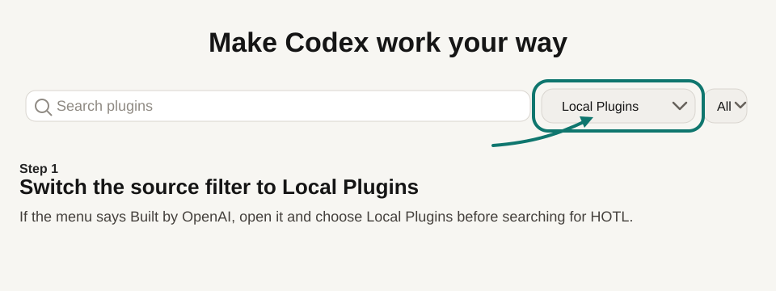
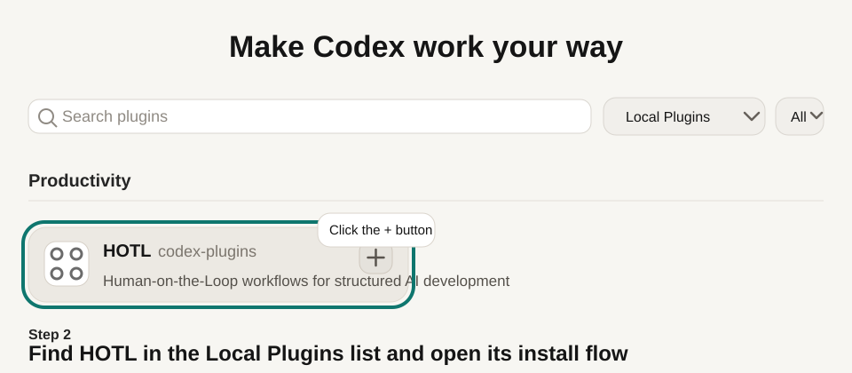
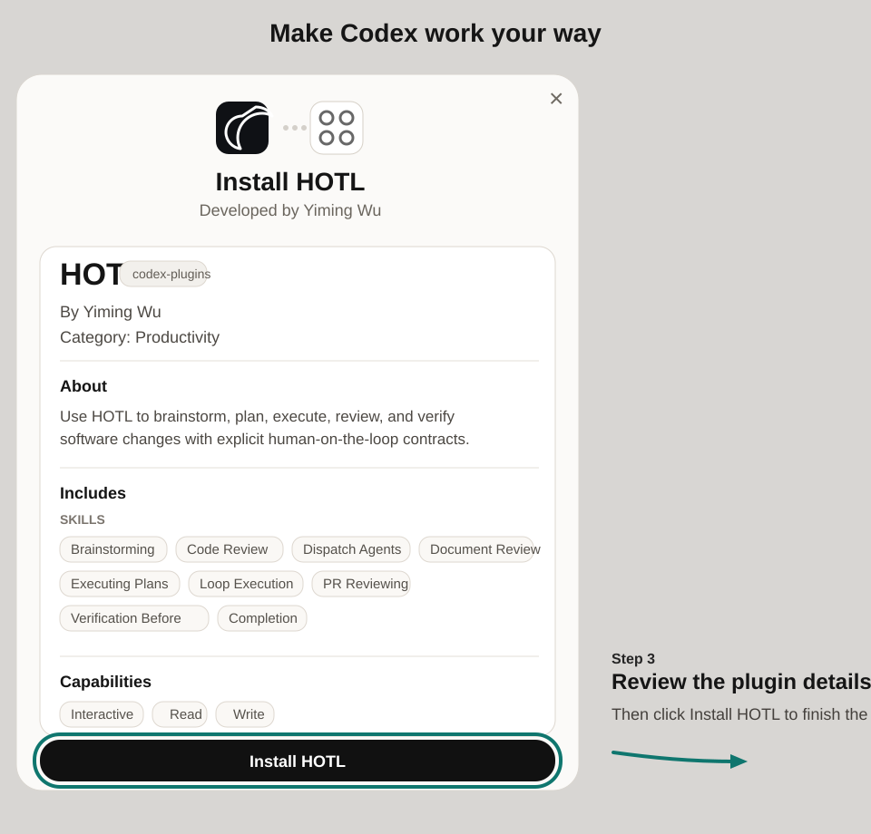
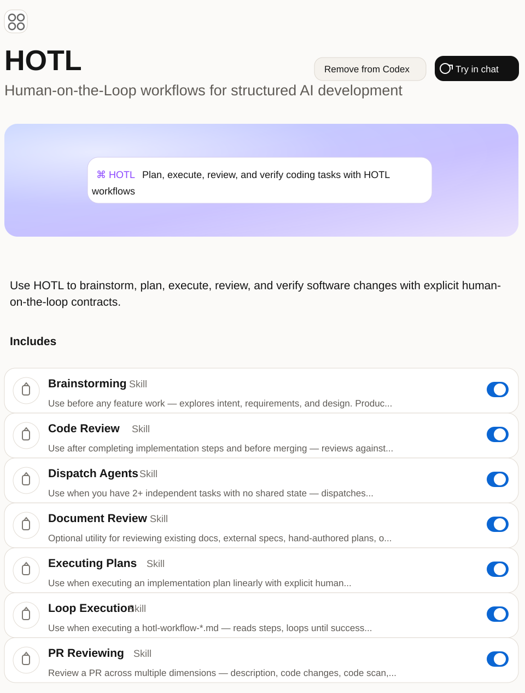

# HOTL Plugin for Codex

HOTL for Codex can be installed either as a native Codex plugin or as native skills. Plugin install is the recommended path for reusable, versioned team setup; native skills remain the lightweight option for local development and older Codex builds. Both modes give you the same HOTL skills to brainstorm, plan, execute, review, and verify changes with more structure.

## Installation

| Mode | Best for | Updates managed by |
|---|---|---|
| **Plugin Install** (recommended) | Stable versioned team installs | Codex plugin lifecycle |
| **Native Skills Install** (fallback / development) | Fast iteration, contributors, older Codex | `update.sh` |

### Plugin Install (Recommended)

Requires a Codex version with plugin support. The installer clones the HOTL repo
to a source checkout at `~/.codex/plugins/hotl-source/` and registers it in
`~/.agents/plugins/marketplace.json` as a local Codex plugin.

1. Clone the repo (or use an existing checkout):

```bash
git clone https://github.com/yimwoo/hotl-plugin /tmp/hotl-plugin
```

2. Run the installer with the `--codex-plugin` flag:

```bash
bash /tmp/hotl-plugin/install.sh --codex-plugin
```

This clones HOTL to `~/.codex/plugins/hotl-source/` and writes a marketplace
entry with `"source": "local"` pointing at that checkout.

3. Restart Codex.

4. Open the Codex plugin directory and finish the install in the UI:

   1. Switch the source filter to **Local Plugins**.

      

   2. Find **HOTL** in the list and click the `+` button to open the install dialog.

      

   3. Review the plugin details and click **Install HOTL**.

      

   4. After installation, confirm the HOTL plugin page opens and shows **Try in chat**.

      

   If the plugin list is long, use the search box to filter for `HOTL`.

**For contributors** testing the plugin from a working copy, use `--local`
to point the marketplace at your current checkout without cloning:

```bash
bash install.sh --codex-plugin --local
```

This writes a repo-local marketplace entry at `.agents/plugins/marketplace.json`
pointing at your checkout directory.

**Generated marketplace entry shape:**

```json
{
  "name": "hotl",
  "source": {
    "source": "local",
    "path": "~/.codex/plugins/hotl-source"
  },
  "policy": {
    "installation": "AVAILABLE",
    "authentication": "ON_INSTALL"
  },
  "category": "Productivity"
}
```

Plugin updates are handled via `update.sh --codex-plugin` (see Updating below).

### Native Skills Install (Fallback / Development)

Works with all Codex versions. Clone the repo and symlink the skills directory.
This gives you direct access to skill files for fast iteration and development.

#### macOS / Linux

1. Clone the repo:

```bash
# From GitHub (internet)
git clone https://github.com/yimwoo/hotl-plugin ~/.codex/hotl

# From OraHub (corporate network)
git clone git@orahub.oci.oraclecorp.com:.../hotl-plugin ~/.codex/hotl
```

2. Create the skills symlink:

```bash
mkdir -p ~/.agents/skills
ln -s ~/.codex/hotl/skills ~/.agents/skills/hotl
```

3. Restart Codex.

#### Windows (PowerShell)

1. Clone the repo:

```powershell
# From GitHub (internet)
git clone https://github.com/yimwoo/hotl-plugin "$env:USERPROFILE\.codex\hotl"

# From OraHub (corporate network)
git clone git@orahub.oci.oraclecorp.com:.../hotl-plugin "$env:USERPROFILE\.codex\hotl"
```

2. Create the skills junction:

```powershell
New-Item -ItemType Directory -Force -Path "$env:USERPROFILE\.agents\skills"
cmd /c mklink /J "$env:USERPROFILE\.agents\skills\hotl" "$env:USERPROFILE\.codex\hotl\skills"
```

3. Restart Codex.

## Stable Channel

For the **Native Skills Install**, `~/.codex/hotl` is the HOTL stable channel and
should track `origin/main`. Do not do feature work inside that directory. If you
want to develop HOTL itself, use a separate clone or worktree somewhere else and
keep `~/.codex/hotl` for the version Codex discovers.

For the **Plugin Install**, Codex manages the cached copy. Updates come through
Codex's plugin lifecycle.

### Coexisting With Native Skills

Plugin install does not remove an existing native-skills install at `~/.codex/hotl`
or the symlink at `~/.agents/skills/hotl`.

If both install modes are present, Codex may discover more than one HOTL source.
Because both sources expose the same skill names, HOTL does not guarantee which
source Codex will use.

Recommended migration path:

1. Install HOTL in plugin mode.
2. Restart Codex and confirm the plugin works.
3. Remove `~/.agents/skills/hotl` if you want plugin mode to be the only active
   Codex install.
4. Optionally remove `~/.codex/hotl` too if you no longer want the native-skills
   checkout on disk.

If you want the fastest local iteration workflow as a HOTL contributor, keep using
Native Skills Install instead of plugin mode.

## How It Works

Both install modes expose the same HOTL skills to Codex. The difference is how
Codex discovers them:

- **Plugin Install:** Codex installs HOTL from the marketplace entry and caches
  the plugin under `~/.codex/plugins/cache/`. Skills are discovered from the
  plugin's skill directory.
- **Native Skills Install:** Codex discovers skills in `~/.agents/skills/` at
  startup. The symlink at `~/.agents/skills/hotl` points to the canonical skill
  files. Codex discovers every entry under `~/.agents/skills/`, so the Installed
  skills screen mixes HOTL with any other installed skill packs.

In both cases, the `using-hotl` skill provides the HOTL skill index and routing
guidance for the rest of the skill set. Codex uses the skill files directly.

When a HOTL skill needs a bundled helper such as `document-lint.sh`,
`render-execution-summary.sh`, or `runtime/hotl-rt`, resolve it from the HOTL
install rather than from the repo being worked on. In Codex, the relevant
install roots are:

- Native skills: `~/.codex/hotl/`
- Plugin source checkout: `~/.codex/plugins/hotl-source/`
- Plugin cache fallback: `~/.codex/plugins/cache/codex-plugins/hotl/*/`

There is no `/hotl:brainstorm` or `/hotl:pr-review` command syntax in Codex.
Instead, describe the task in natural language and let HOTL route it, or
explicitly mention an installed skill such as `$brainstorming`, `$writing-plans`,
or `$pr-reviewing`.

## How To Invoke HOTL Skills In Codex

You can invoke HOTL in two ways:

- Describe the task in natural language and let Codex choose the right HOTL skill.
- Explicitly mention a specific installed skill with a `$` prefix when you want a precise workflow.

If you do not name a skill, Codex can still choose from the installed HOTL skills
based on your request. Use the `$skill-name` form when you want to force a specific skill.
Codex may display these skills in the UI as title-cased labels such as `Brainstorming`
or `Code Review`.

Examples:

```text
Use `$brainstorming` to compare OAuth and API-key auth before writing code.

Please use HOTL to compare OAuth and API-key auth before writing code.

Use `$writing-plans` to create `hotl-workflow-add-rate-limiting.md`.

After a plan is saved, use `$loop-execution`, `$executing-plans`, `$subagent-execution`,
or `$resuming` with the workflow filename instead of Claude-style `/hotl:*` commands.

Review `hotl-workflow-add-rate-limiting.md` with HOTL and tell me if it is ready to execute.

Use `$subagent-execution` to execute `hotl-workflow-add-rate-limiting.md` in this session.

Use `$loop-execution` to execute `hotl-workflow-add-rate-limiting.md` in this session.

Use `$executing-plans` to execute `hotl-workflow-add-rate-limiting.md` with manual checkpoints.

Use `$resuming` to continue `hotl-workflow-add-rate-limiting.md`.

Use `$pr-reviewing` to review https://github.com/org/repo/pull/123.

Before you say this task is done, use `$verification-before-completion`.

Use HOTL for this task and choose the most appropriate skill automatically.
```

## Codex vs Claude Code

| Tool | How HOTL is invoked |
| --- | --- |
| Codex | Natural-language prompts or explicit skill mentions such as `Use HOTL to plan this` or `$brainstorming` |
| Claude Code | Slash commands such as `/hotl:brainstorm` and `/hotl:pr-review` |

## Common Skills

- `brainstorming` — design with HOTL contracts before implementation
- `writing-plans` — create `hotl-workflow-<slug>.md` files
- `document-review` — run structural lint and qualitative review before execution
- `loop-execution` — autonomous execution with retries
  - **Output contract:** `docs/contracts/execution-report-output.md` defines the execution report schema, status vocabulary, and platform rendering tables
  - **Optional dependency:** State persistence and resumable execution require [`jq`](https://jqlang.github.io/jq/). Without it, HOTL still works but runs without state files or durable reports.
  - **Codex native progress (mandatory):** HOTL must use the native progress card as the primary live step visibility surface. If the native tool is unavailable or errors, immediately switch to per-step chat logs.
  - **Codex final summary:** must use compact step list in chat (not wide markdown table). Durable report keeps the full table.
  - **Codex helper path:** use `scripts/finalize-codex-summary.sh` so finalize and rendering happen sequentially from one helper instead of separate ad hoc commands.
  - **Codex final response:** the rendered compact summary must appear directly in the final assistant message as visible chat text. A narrative wrap-up can follow, but cannot replace the summary lines.
  - **Current step helper:** use `scripts/show-codex-current-step.sh` when you need an explicit current-step readout in Codex chat.
  - **Deterministic renderer:** `scripts/finalize-codex-summary.sh` delegates to `scripts/render-execution-summary.sh`, which remains the source of truth for Codex summary formatting.
- `executing-plans` — manual checkpointed execution (references same output contract)
- `subagent-execution` — same-session delegated execution with controller-owned verification (references same output contract)
- `pr-reviewing` — review a PR across description, code, scan, and tests
  - **Output contract:** `docs/contracts/pr-review-output.md` defines the canonical 9-section review schema
  - **Codex rendering (advisory):** emit platform-native inline findings first (e.g., `::code-comment` directives for BLOCK and WARN findings with file:line), then render the full 9-section structured summary. Use plain markdown for the summary.
- `code-review` — user-facing entry point for code review; dispatches the full `code-reviewer` agent by default, returns findings only
  - **Output contract:** `docs/contracts/code-review-output.md` defines the canonical 6-section review schema
  - **Codex rendering profile:**
    - Emit `::code-comment` directives only for actionable, file-localized defects at BLOCK or WARN severity
    - Keep `priority` and `confidence` as machine-readable metadata in the directive — do not surface `[P1]`/`[P2]` in the title. Titles must be plain descriptive text (e.g., `"Debug server exposed on all interfaces"`)
    - Workflow/governance findings, NOTE-severity observations, and findings without a specific file:line stay in the markdown summary only — no `::code-comment`
    - `::code-comment` is additive rendering — the full 6-section structured summary is always emitted regardless of how many annotations exist
    - Dedup: when inline annotations are emitted, the Findings section uses a grouped one-liner (1–5: category breakdown; 6+: collapsed) instead of restating each finding
- `requesting-code-review` — dispatched by executors at review checkpoints with git range, contracts, and verification evidence
- `receiving-code-review` — governs how agents handle review findings: verify each claim against the codebase and HOTL contracts before acting (Verify → Evaluate → Respond → Implement)
- `verification-before-completion` — require test and command output before claiming success

## Updating

### Native Skills Install

Use `update.sh` to update the native skills install at `~/.codex/hotl`.

**macOS / Linux:**

```bash
curl -fsSL https://raw.githubusercontent.com/yimwoo/hotl-plugin/main/update.sh | bash
```

Or if already cloned:

```bash
bash ~/.codex/hotl/update.sh
```

**Windows (PowerShell):**

```powershell
Invoke-WebRequest -Uri "https://raw.githubusercontent.com/yimwoo/hotl-plugin/main/update.ps1" -OutFile "$env:TEMP\hotl-update.ps1"; powershell -ExecutionPolicy Bypass -File "$env:TEMP\hotl-update.ps1"
```

Or if already cloned:

```powershell
powershell -ExecutionPolicy Bypass -File "$env:USERPROFILE\.codex\hotl\update.ps1"
```

---

The updater fetches the latest script first, then scans for all supported HOTL
installs and refreshes every one it finds in the same run. If you have Claude
Code, Codex, and Cline installs side by side, one updater run will process them
sequentially.

For the native-skills Codex install, the updater refreshes the stable install at
`~/.codex/hotl` (macOS/Linux) or `%USERPROFILE%\.codex\hotl` (Windows).

If the install drifted onto another branch, the updater switches it back to
the stable `main` branch before syncing.
If it finds local changes in the Codex install, it saves a snapshot under
`~/.codex/backups/hotl/<timestamp>/` (or `%USERPROFILE%\.codex\backups\hotl\` on Windows) and then resets the stable install to the
latest `origin/main`.

If you intentionally want to discard local Codex changes without saving that
backup, run:

```bash
bash ~/.codex/hotl/update.sh --force-codex        # macOS/Linux
```

```powershell
powershell -ExecutionPolicy Bypass -File "$env:USERPROFILE\.codex\hotl\update.ps1" -ForceCodex   # Windows
```

To check if an update is available without updating:

```bash
bash ~/.codex/hotl/update.sh --check               # macOS/Linux
```

```powershell
powershell -ExecutionPolicy Bypass -File "$env:USERPROFILE\.codex\hotl\update.ps1" -Check        # Windows
```

Codex does not have a guaranteed HOTL startup-notice path for native skills
installs, so do not rely on a SessionStart update banner. Use the manual check
command above when you want to verify whether `~/.codex/hotl` is behind.

Restart Codex after updating so it re-discovers the latest skill files.

### Plugin Install

The standard curl one-liner also updates the plugin source checkout if it exists:

```bash
curl -fsSL https://raw.githubusercontent.com/yimwoo/hotl-plugin/main/update.sh | bash
```

Or update only the plugin checkout:

```bash
bash ~/.codex/plugins/hotl-source/update.sh --codex-plugin
```

If the source checkout has local changes, they are backed up to
`~/.codex/backups/hotl-plugin/<timestamp>/` before resetting.
Use `--force-codex-plugin` to skip the backup.

Important:

- `update.sh --codex-plugin` updates `~/.codex/plugins/hotl-source`
- It also refreshes the local Codex plugin cache at `~/.codex/plugins/cache/codex-plugins/hotl/` when present
- If you still have the old copied-bundle install at `~/.codex/plugins/hotl`,
  the updater reports it and skips it; migrate with `bash install.sh --codex-plugin`

Restart Codex after updating so it picks up the new plugin files.

## Codex Manual Canary

Use this short canary when you want to validate Codex execution UX in the real app:

1. Run a HOTL workflow that has at least one gate and at least one verified implementation step.
2. Confirm the native progress card appears immediately after runtime initialization.
3. Confirm only one workflow step is shown as active at a time.
4. Confirm the run ends with a visible final chat summary that includes every step, its status, and its attempt count or gate marker.
5. If the native progress card does not appear or errors, confirm HOTL falls back to per-step chat logs and still shows the final chat summary.

Expected compliant final Codex response shape:

```text
Execution Summary

✓ Step 1: Write failing tests - Done (1 attempt)
✓ Step 2: Implement auth logic - Done (3 attempts)
⚡ Step 3: Security review gate - Auto-approved (-)
✓ Step 4: Run full test suite - Done (65 tests, 1 attempt)
✓ Step 5: Human review - Approved (1 attempt)

Tests: 65 passed
Behavior: walkthrough completed in the app
```

Non-compliant example:

```text
The workflow finished successfully. Tests passed and the app looks good.
```

That prose-only wrap-up is not enough because it omits the rendered step-by-step execution summary.

When the repo includes `scripts/render-execution-summary.sh`, use it as the source of truth for final-summary formatting. If chat output disagrees with `.hotl/reports/<run-id>.md` or the renderer output, trust the runtime artifacts first.

## Uninstalling

### Native Skills Install

**macOS / Linux:**

```bash
rm ~/.agents/skills/hotl
rm -rf ~/.codex/hotl
```

**Windows (PowerShell):**

```powershell
Remove-Item "$env:USERPROFILE\.agents\skills\hotl" -Force
Remove-Item -Recurse -Force "$env:USERPROFILE\.codex\hotl"
```

### Plugin Install

Remove the source checkout and marketplace entry:

**macOS / Linux:**

```bash
rm -rf ~/.codex/plugins/hotl-source
# Edit ~/.agents/plugins/marketplace.json and remove the hotl entry
```

**Repo-local:** Delete `.agents/plugins/marketplace.json` or remove the `hotl` entry from it.
